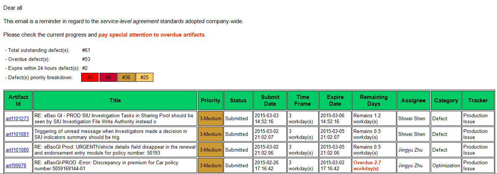

SLA Reminder Mailing Robot
==========================

Overview
--------
In accordance with your organization's *service-level agreement (SLA)* standards, sending reminder emails to team members describing the current progress, so that your SLA commitments can always be fulfilled.

Mail contents including:
* Summary
  - Total outstanding defect(s)
  - Overdue defect(s)
  - Expire within 24 hours defect(s)
  - Defect(s) priority breakdown

* Item List
  - Integrated with [Teamforge](http://www.collab.net/products/teamforge "Go to official site"), presenting a list of artifacts based on customized query criteria, with configurable data fields and metrics.

Sample
------

License
-------
[GNU GENERAL PUBLIC LICENSE v2.0](./LICENSE "See license")
